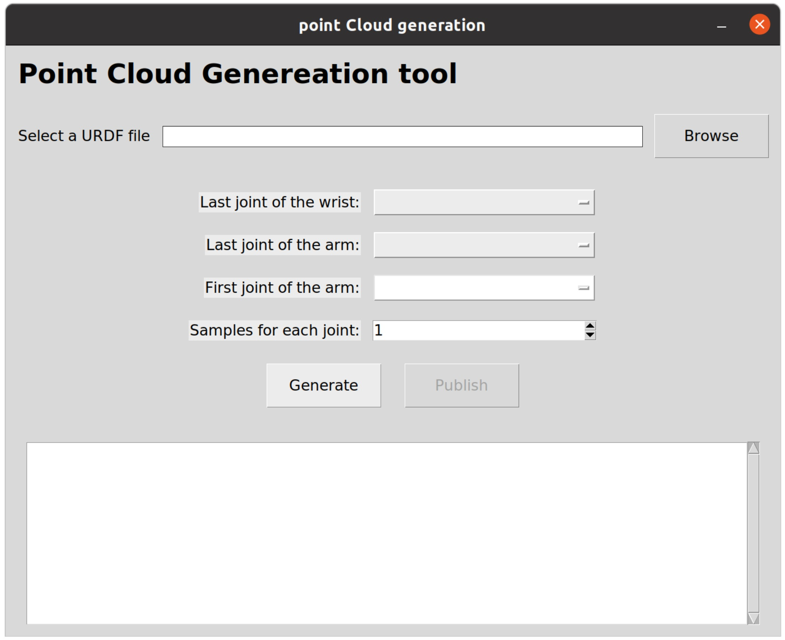
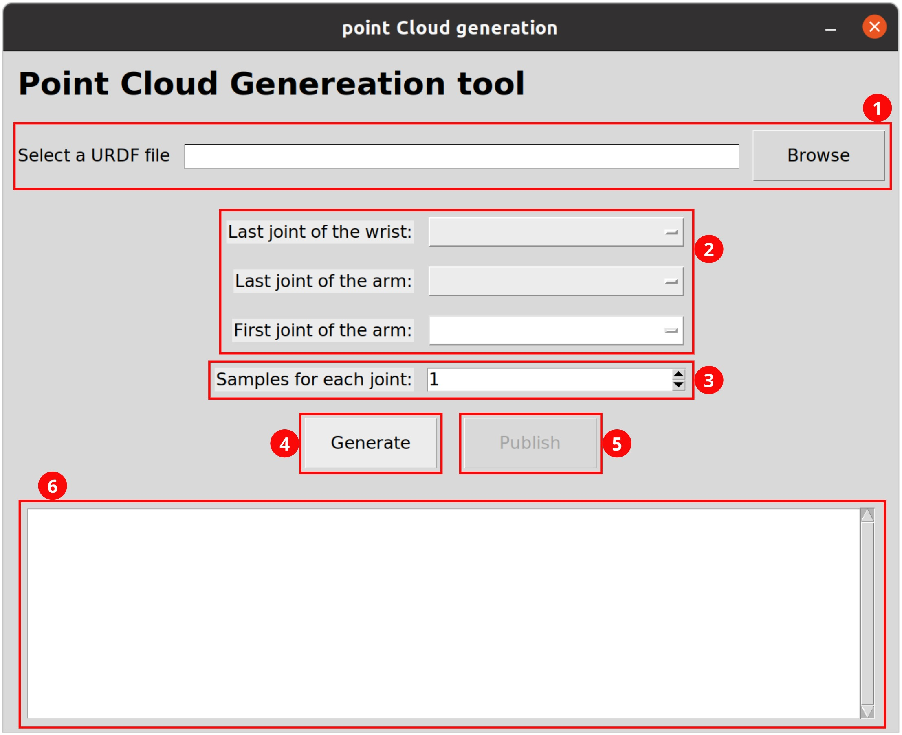
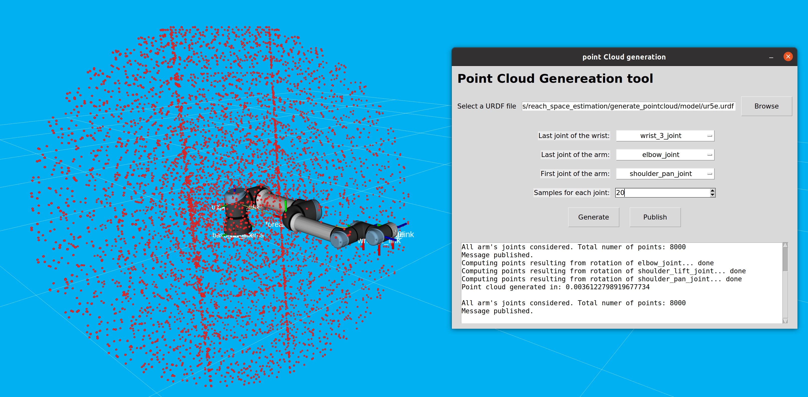
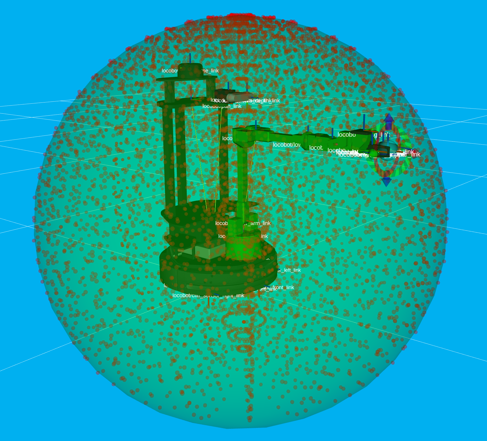

# Robotic manipulators reachability space modeling

## Table of contents
+ [Introduction](#introduction)
+ [Prerequisites](#prerequisites)
+ [Point cloud generation](#point-cloud-generation)
    + [Notice](#notice)
    + [Usage](#usage)
    + [Example](#example)
+ [Optimization problem](#optimization-problem)
    + [Problem definition](#problem-definition)
    + [Usage](#usage)
    + [Example](#example-1)
+ [Variants of the PointNet](#variants-of-the-pointnet)
    + [Available models](#available-models)
    + [Dataset](#dataset)
        + [Usage](#usage-2)
    + [Training](#training)
        + [Training details](#training-details)
        + [Saves](#saves)
    + [Evaluation](#evaluation)


## Introduction
This repository provides tools and resources for modeling and analyzing the reachability space of robotic manipulators using ellipsoid equations. A first tool allows to obtain the **point cloud representing a set of the reachable points** using only the kinematic model of the desired robot. This method is applicable to **different kind of manipulators**, with fixed or mobile bases. For the latters, the additional Degree of Freedoms (DOFs) introduced by the mobile base are not considered. Hence an estimation, and a subsequent model, of the reachability space of the manipulator depending on the current pose of the base is obtained.

Starting from the point cloud obtained before, **an ellipsoid equation is obtained**. The parameters of the ellipsoid, namely the coordinates of the center and the lenghts of axes, are obtained as a result of an** optimization problem**. Two different tools to solve the optimization problem can be used:
* a proper minimization problem
* different variants of the PointNet models.

The code contained in this repository has been used for the experimental evaluation in paper "Modeling the Reachability Space of Robotic Manipulators through Ellipsoid Equations".

**Keywords**: Robotic Manipulators, Reachability Space, Ellipsoid Modeling, Optimization.

## Prerequisites
Before installing and using this repo, please be sure to meet the following prerequisites:
1. **Python version**: Make sure you have Python 3.8.0 or higher installed. You can download it from [here](https://www.python.org/downloads/).
2. **ROS**: You need to have **ROS Noetic** installed. For the installation, please check the [official website](https://wiki.ros.org/noetic/Installation/Ubuntu).
3. **Rviz**: although not strictly necessar, it is suggested to have the Rviz ROS package installed, in order to try all the features of the proposed code. You can install by executing the following command:
    ```
    sudo apt-get install ros-noetic-rviz
    ```
4. **Needed libraries**: please make sure to install all the libraries needed to run the code by executing the command:
    ```
    pip install -r requirements.txt
    ```


## Point cloud generation
This tool allows to generate a point cloud representing the reachability space starting from the URDF of a robot.

To obtain a point cloud representing the points that can be reached by the desired manipulator, it is possible to run the Python code *gen_cloud_GUI.py* in the *generate_pointcloud* folder:

```python
python3 generate_pointcloud/gen_cloud_GUI.py
```

### Notice
The use of this script alone is intended for visualization purposes only. Before creating and visualizing the GUI (Graphical User Interface) to generate the desired point cloud, **a ROS node named *reachability_pointcloud_publisher* is created**. For this reason, **the ROS master node must be running** before the desired point cloud can be generated using the proposed GUI.

### Usage
The center of the code is represented by the GUI showed below.

<div align="center">
    
</div>

It is possible to identify a total of 6 sections, as highlighted in the following picture.

<div align="center">
    
</div>

In more details:

1. The first component constitues of a search bar and a *Browse* button that allow to select the desired URDF file. Some URDF of well known manipualtors, both with fixed and mobile bases, are provided in the *generate_pointcloud/models* folder.

2. The second section is composed by 3 drop-down menus. Each of them contains a list of the names of the actuated joints of the robot. By clicking on one item of the list, it is possible to select the *last joint of the wrist*, the *last joint of the arm* and the *first joint of the arm*. It is important to notice that **all the points constituting the point cloud are computed considering as origin the one of the reference frame of the joint selected as first joint of the arm**.

3. The third component allows to select the number of samples that will compose the span of possible values for each joint. As a consequence, if the manipulator is composed by a total of *j* joints, and a total of *N* values for each joint are considered, the total number of points constituting the point cloud will be equal to *N^j*.

4. The *Generate* button allows the computataion of the point cloud.

5. The *Publish* button allows the ROS node created at the beginning (*reachability_pointcloud_publisher*) to publish a **PointCloud2 ROS message**, containing the newly generated point cloud, on a topic named **/reachability_pointcloud**.

6. A read-only text box is used to show important information during the generation of the point cloud, as well as error and/or debugging messages.

### Example
As an example, the point cloud obtained for the ur5e manipulator from the Universal Robotics (whose URDF is available in the *generate_pointcloud/models* folder) is showed. The visualization of the robot model along with the newly computed point cloud is obtained exploiting **Rviz for ROS Noetic**.

Please note that, as cited above, using the *gen_cloud_GUI.py* script will result only in the computation of the point cloud and eventually its visualization. As a result, the ellipsoid is not visible, since its parameters are not computed.

<div align="center">
    
</div>


## Optimization problem
The first way to compute the parameters of the ellipsoid is by solving a proper optimization problem. For more details about the design of the optimization problem please refere to the paper.

All the files needed to obtain the equation of the ellipsoid enclosing the reachability space are contained in the ***opt_problem*** folder.

### Problem definition
The ***problem_formulation.py*** file contains the definition of a class where the optimization problem is defined, named **EllipsoidEquationOptProblem**, by extending the *ElementwiseProblem* class of the *pymoo* library.

When an object of this class is instantiated, a set of few operations are completed, as specified in the *\__init__* method. In order:
1. the points building the point cloud of the desired manipulator are retrieved;
2. if not provided, an estimation of the center of the point cloud as the mean point is computed;
3. the parameters of the optimization problem are set. More in details, the number of optimization variables, the number of objective functions, the inequality contraints, the lower and upper bounds of the optimization variables.

A second method, namely *_evaluate*, is defined. It is the function that is called at every iteration of the optimization problem.  It retrieves the current solution and computes the values of the objective function until now.

### Usage
It is possible to obtain the equation of the ellipsoid by running the script *eqn_solv_opt.py*:
```
python3 opt_problem/eqn_solv_opt.py
```
This script is based on the GUI described above to select the URDF of the robot, to select the important joints, the number of samples per joint and, finally, to genereate the point cloud exploited by the optimization problem.

It is important to notice that the parameters characterizing the equation of the ellipsoid are computed as soon as the point cloud is obtained and after the GUI has been closed.

It is possible to select the desired optimization algoritm by changing the value of the variable *alg_name*. The possible strings are:
* ***"PatternSearch"*** to run the optimization problem using the Pattern Search algorithm;
* ***"GA"*** to run the optimization problem exploiting the Genetic Algorithm;
* ***"PSO"*** to run the optimization problem using the Particle Swarm Optimization Algorithm.

Once the optimization problem is solved, the parameters of the best solution found are printed on the screen. In addition to that, 2 ROS messages are created and published:
1. A ***Marker*** message is published by the *reachability_pointcloud_publisher* node (initialized when the GUI is created) on a topic named ***/vis_reachability_ellipsoid***. The marker's position and the lenght of its axes are equal to the parameters characterizing the ellipsoid equation. In this way, a visualization of the computed equation can be obtained and displayed in Rviz.

2. A ***PointCloud2*** message is published by the *reachability_pointcloud_publisher* node on a topic named ***/vis_ellipsoid_center***. It is used to show the center of the ellipsoid.

### Example
As an example, here it is visualized the ellipsoid (in green) enclosing the reachability space of the LoCoBot WX250s from Trossen Robotics (whose URDF can be found in the *generate_pointcloud/models* folder), along with the point cloud (in red).

<div align="center">
    
</div>


## Variants of the PointNet
The second method proposed to compute the parameters of the ellipsoid equation is based on the PointNet model. A recall of the model's architecture is depicted in the following picture.

<div align="center">
    
</div>

The objective of this model is to predict the 6 parameters characterizing the ellipsoid equation starting directly form the point cloud rapresenting the reachability space.

### Available Models
In order to adapt to different machines with different computational capabilities, 3 different variants of the classical PointNet model have been realized, trained and tested. They differ only for the number of parameters characterizing them. More in details:
1. the ***"pointnet_cls"*** model is the original architecture of the PointNet, with a total of **2.4M parameters**;
2. the ***"pointnet_small"*** model has been obtained by halving the number of parameters of each convolutional and multiperceptron layers building the classical model. As a result, this smaller version is constituted by a total of **613K parameters**;
3. the ***"pointnet_tiny"*** model has been obtained by further reducing by a half the parameters of each layer of the *pointnet_small* model. This results in a model characterized by a total of **182K parameters**.

To code to build each of the model described above is available in the ***pointNet/models*** folder.

### Dataset
To train and test the different models, a dataset containing 10.000 different point clouds has been created. Before creating a new point cloud, the equation to be associated to it is generated. The values to the 6 parameters characterizing it are randomly generated using a uniform distribution between 0 and 1. This choice was driven by the way ML models learn, together with the mechanical properties of manipulators commonly used in the research field, whose span vary from few centimeters and to slightly beyond 1 meter.

The .h5 file containing the generated dataset, named ***"dataset_10000.h5"***, can be found in the **pointNet/dataset** folder, together with a Python script. This latter, named ***"load_dataset/py"***, contains all the function to:
* load the .h5 file,
* convert it in tensor slices,
* parse the dataset and reduce the number of points (if requested),
* split it in train and test dataset,
* perfom a data normalization pre-processing.

The default split of the dataset is 80-20, hence the 80% of the point clouds in the dataset are used to build the training set, while the remeaning 20% are used to build the validation dataset.

#### Usage
To load the desired dataset it is sufficient to (import) and call the *"get_dataset"* function from *load_dataset.py*. The parameters of the function and the default values are discussed below:
* *h5file_path*: is a sting containing the path to the .h5 file containing the file or just its name. In this latter case, it is assumed that the file is located inside the *dataset* folder. The default value is "dataset_10000.h5".
* *shuffle*: is a bool parameter, whose default value is True. It is used to shuffle the dataset while parsing it.
* *des_num_points*: is an int number, whose default value is 2048, and can be used to reduce the number of points of each point cloud in the dataset.
* *perc_train*: is a float number, whose default value is 0.8. It represents the percentage of dataset dedicated to the train set.
* *perc_val*: is a float number, whose default value is 0.8. It represents the percentage of dataset dedicated to the validation set.
* *vis_sample*: is a bool parameter set by default to False. Setting this parameter to True will result in a random poin cloud of the dataset being visualized during the parsing operation.

### Training 
If you want to train one of the proposed models from scratches, it is possible to run the ***"train_eqn.py"*** script. It accepts the following parameters:
* **--h5file**: path or name of the .h5 containing the dataset. Default to *"dataset_10000.h5"*.
* **--model_type**: string indicting the type of model to train. Default to *"pointnet_cls*". Accepted values *["pointnet_cls", "pointnet_cls_small", "pointnet_cls_tiny"]*.
* **--epochs**: int number expressing the number of training epochs. Default to 10.
* **--restore_training**: bool to restore a previous training. Default to False.
* **--restore_from_last**: bool to restore a previous training from the last epoch. Default to False.
* **--restore_from_best**: bool to restore a previous training from the best result obtained. Default to False.
* **--save_last**: bool to save the last result obtained during the training process. Default to True.
* **--save_best**: bool to save the best result obtained during the training process. Default to True.

An help menu withe the description of the accepted parameters can be obtained by writing:
```
python3 pointNet/train_eqn.py --help
```
or
```
python3 pointNet/train_eqn.py -h
```

An example of command to launch a fresh new training of the *small* model for 100 epochs, saving both the last and the best results, is the following:
```
python3 pointNet/train_eqn.py --model_type pointnet_cls_small --epochs 100 --save_last True --save_best True
```

#### Training details
The training process is performed considering a batch size of 16 point clouds, and The MSE (Mean Square Error) as loss function. The optimizer used is the Adam optimizer, initialized with a learning rate of 0.001. A callback to reduce the learning rate on plateau, with a patience of 25 epochs, is used. 

#### Saves
During the training process, some checkpoint are saved in the the ***"pointNet/saves"*** folder. The training results of the considered model are saved in a subfolder with the same name of the model. The **best**, the **last** results and the **training history** are stored in specific folders.

### Evaluation
It is possible to test one of the pre-trained models by running the script named ***"evaluate_eqn_gpu.py"***. It accepts the following parameters:
* **--model_type**: string indicting the type of model to train. Default to *"pointnet_cls*". Accepted values *["pointnet_cls", "pointnet_cls_small", "pointnet_cls_tiny"]*.
* **--restore_from_last**: bool to load the parameters obtained with the last training epoch. Default to False.
* **--restore_from_best**: bool to load the best set of parameters obtained during the training. Default to False.

Example:
```
python3 pointNet/train_eqn.py --model_type pointnet_cls_small --restore_from_best True
```

The expected outcome is a table printed on the command windows containing the ground truth values, the predicted parameters of the equation and the relative percentage error. In addition, the point cloud is visualized along with the ground truth ellipsoid and the predicted one.


## Experimental evaluation


