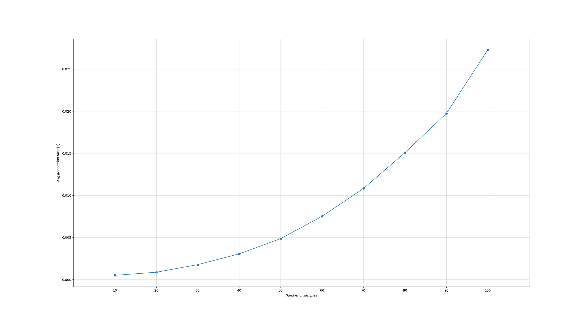

## Experimental evaluation

### Table of contents
+ [Introduction](#introduction)
    + [Data and Results folders](#data-and-results-folders)
    + [Evaluation of the point cloud generation](#evaluation-of-the-point-cloud-generation)
    + [Evaluation of the optimization problem](#evaluation-of-the-optimization-problem)
    + [Evaluation of the PointNet variants](#evaluation-of-the-pointnet-variants)

### Introduction
The ***"experimental_evaluation"*** folder contains data and code to evaluate the results obtained for each of the proposed components.

### Data and Results folders
The **"experimental_evaluation/data"** folder contains a total of 3 .h5 files. They are dataset containing 100, 1000 and 5000 point clouds, generated following the same rules used [here](#dataset) for the dataset used to train the PointNet models.

The **"experimental_evaluation/results"** folder contains .h5 and .mat files with the results of different tests. More in details, it contains:
- 3 .mat files, namely *"ur5e_gen_times.mat"*, *"ur5e_gen_times_FK.mat"* and *"ur5e_gen_times_IK.mat"*, containing the time needed to genereate point cloud of different sizes for the ur5e robot, and using, respectively, our method, the one base on forward kinematic (FK), and one based on the inverse kinematic (IK).
- one .h5 with the results and the performances of each variants of the PointNet models (full, small and tiny), and for each dataset contained in the *"data"* folder.
- one .h5 with the results and the performances obtained with the 3 possible optimization algorithms (PatternSearch, Ga and PSO), and for each dataset contained in the *"data"* folder.

### Evaluation of the point cloud generation
To compare the time needed by the 3 possible way to generate the reachability point cloud of the ur5e robot, it is possible to use the ***"ur5e_fk.py", "ur5e_ik.py" and "gen_cloud_eval.py"*** scripts.

Each of them will generate the reachability point cloud of the reference robot considering:
- a number of samples per joint ranging from 10 to 100, with a step size of 10,
- 10 trials for each number of samples.

The first 2 scripts use the methods based on the forward kinematic (FK) and the inverse kinematic (IK), respectively. The ***"gen_cloud_eval"*** script will run the test exploiting our method. First, the GUI previously described is visualized, allowing the selction of the URDF and the important joint (as explained [here](#usage)). Right after closing the GUI, the experiment is executed considering the different sample size.

The average time and the variance needed by the different methods, for different values of samples per joint are saved in the corresponding .mat file.

In addition, each script will generate a pyplot with the average time. As an example, the one obtained executing the *"gen_cloud_eval.py"* script is reported below.

    

### Evaluation of the optimization problem
To evaluate the accuracy obtained computing the ellipsoid parameters using the proposed optimization problem, it is possible to run the ***"opt_prob_eval.py"*** script. It will run a series of test, with parameters equal to those used in the evaluation of the reachability point cloud evaluation, for all the optimization algorithms considered. For each algorithm, a .h5 file is created and stored in the *"results"* folder. Each .h5 folder contains the mean, the median, the minimum and the maximum errors for each of the 6 parameters characterizing the ellipsoid equation, and for each value of samples per joint.

### Evaluation of the PointNet variants
To assess the accuracy achieved by computing the ellipsoid parameters using the trained variants of the PointNet, it is possible to execute the ***"pointNet_eval.py"*** script. This script will conduct a series of tests using parameters identical to those employed before, for the PointNet model selected using the "--model_type" argument (in the same way that is described [here](#available-models)). As a result, a .h5 file will be generated and saved in the *"results"* folder; it contains the mean, median, minimum, and maximum errors for each of the six parameters that define the ellipsoid equation, and that have been predicted by the selected model.

Running the same script for all the variants it is possible to obtain the performancs of all the proposed and trained models.