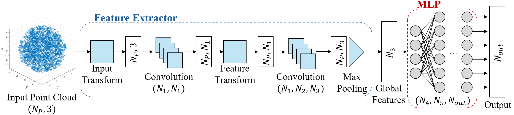

## Variants of the PointNet

### Table of contents
+ [Variants of the PointNet](#variants-of-the-pointnet)
    + [Available models](#available-models)
    + [Dataset](#dataset)
        + [Usage](#usage-2)
    + [Training](#training)
        + [Training details](#training-details)
        + [Saves](#saves)
    + [Evaluation](#evaluation)

### Introduction
The second method proposed to compute the parameters of the ellipsoid equation is based on the PointNet model. A recall of the model's architecture is depicted in the following picture.

<div align="center">
    
</div>

The objective of this model is to predict the 6 parameters characterizing the ellipsoid equation starting directly form the point cloud rapresenting the reachability space.

### Available Models
In order to adapt to different machines with different computational capabilities, 3 different variants of the classical PointNet model have been realized, trained and tested. They differ only for the number of parameters characterizing them. More in details:
1. the ***"pointnet_cls"*** model is the original architecture of the PointNet, with a total of **2.4M parameters**;
2. the ***"pointnet_small"*** model has been obtained by halving the number of parameters of each convolutional and multiperceptron layers building the classical model. As a result, this smaller version is constituted by a total of **613K parameters**;
3. the ***"pointnet_tiny"*** model has been obtained by further reducing by a half the parameters of each layer of the *pointnet_small* model. This results in a model characterized by a total of **182K parameters**.

To code to build each of the model described above is available in the ***pointNet/models*** folder.

### Dataset
To train and test the different models, a dataset containing 10.000 different point clouds has been created. Before creating a new point cloud, the equation to be associated to it is generated. The values to the 6 parameters characterizing it are randomly generated using a uniform distribution between 0 and 1. This choice was driven by the way ML models learn, together with the mechanical properties of manipulators commonly used in the research field, whose span vary from few centimeters and to slightly beyond 1 meter.

The .h5 file containing the generated dataset, named ***"dataset_10000.h5"***, can be found in the **pointNet/dataset** folder, together with a Python script. This latter, named ***"load_dataset/py"***, contains all the function to:
* load the .h5 file,
* convert it in tensor slices,
* parse the dataset and reduce the number of points (if requested),
* split it in train and test dataset,
* perfom a data normalization pre-processing.

The default split of the dataset is 80-20, hence the 80% of the point clouds in the dataset are used to build the training set, while the remeaning 20% are used to build the validation dataset.

#### Usage
To load the desired dataset it is sufficient to (import) and call the *"get_dataset"* function from *load_dataset.py*. The parameters of the function and the default values are discussed below:
* *h5file_path*: is a sting containing the path to the .h5 file containing the file or just its name. In this latter case, it is assumed that the file is located inside the *dataset* folder. The default value is "dataset_10000.h5".
* *shuffle*: is a bool parameter, whose default value is True. It is used to shuffle the dataset while parsing it.
* *des_num_points*: is an int number, whose default value is 2048, and can be used to reduce the number of points of each point cloud in the dataset.
* *perc_train*: is a float number, whose default value is 0.8. It represents the percentage of dataset dedicated to the train set.
* *perc_val*: is a float number, whose default value is 0.8. It represents the percentage of dataset dedicated to the validation set.
* *vis_sample*: is a bool parameter set by default to False. Setting this parameter to True will result in a random poin cloud of the dataset being visualized during the parsing operation.

### Training 
If you want to train one of the proposed models from scratches, it is possible to run the ***"train_eqn.py"*** script. It accepts the following parameters:
* **--h5file**: path or name of the .h5 containing the dataset. Default to *"dataset_10000.h5"*.
* **--model_type**: string indicting the type of model to train. Default to *"pointnet_cls*". Accepted values *["pointnet_cls", "pointnet_cls_small", "pointnet_cls_tiny"]*.
* **--epochs**: int number expressing the number of training epochs. Default to 10.
* **--restore_training**: bool to restore a previous training. Default to False.
* **--restore_from_last**: bool to restore a previous training from the last epoch. Default to False.
* **--restore_from_best**: bool to restore a previous training from the best result obtained. Default to False.
* **--save_last**: bool to save the last result obtained during the training process. Default to True.
* **--save_best**: bool to save the best result obtained during the training process. Default to True.

An help menu withe the description of the accepted parameters can be obtained by writing:
```
python3 pointNet/train_eqn.py --help
```
or
```
python3 pointNet/train_eqn.py -h
```

An example of command to launch a fresh new training of the *small* model for 100 epochs, saving both the last and the best results, is the following:
```
python3 pointNet/train_eqn.py --model_type pointnet_cls_small --epochs 100 --save_last True --save_best True
```

#### Training details
The training process is performed considering a batch size of 16 point clouds, and The MSE (Mean Square Error) as loss function. The optimizer used is the Adam optimizer, initialized with a learning rate of 0.001. A callback to reduce the learning rate on plateau, with a patience of 25 epochs, is used. 

#### Saves
During the training process, some checkpoint are saved in the the ***"pointNet/saves"*** folder. The training results of the considered model are saved in a subfolder with the same name of the model. The **best**, the **last** results and the **training history** are stored in specific folders.

Please note that, by default, the training process will create new saves in the *"pointNet/saves"* folder. This folder contains also the set of parameters obtained from our training. It follows that **any new training will overwrite the provided set of parameters**, hence it will be no longer possible to test the pre-trained models.

### Evaluation
To evaluate the performances of the pre-trained model provided, or to see the results of a new training process, it is possible to run the script named ***"evaluate_eqn_gpu.py"***. It accepts the following parameters:
* **--model_type**: string indicting the type of model to train. Default to *"pointnet_cls*". Accepted values *["pointnet_cls", "pointnet_cls_small", "pointnet_cls_tiny"]*.
* **--restore_from_last**: bool to load the parameters obtained with the last training epoch. Default to False.
* **--restore_from_best**: bool to load the best set of parameters obtained during the training. Default to False.

Example:
```
python3 pointNet/train_eqn.py --model_type pointnet_cls_small --restore_from_best True
```

The expected outcome is a table printed on the command windows containing the ground truth values, the predicted parameters of the equation and the relative percentage error. In addition, the point cloud is visualized along with the ground truth ellipsoid and the predicted one.